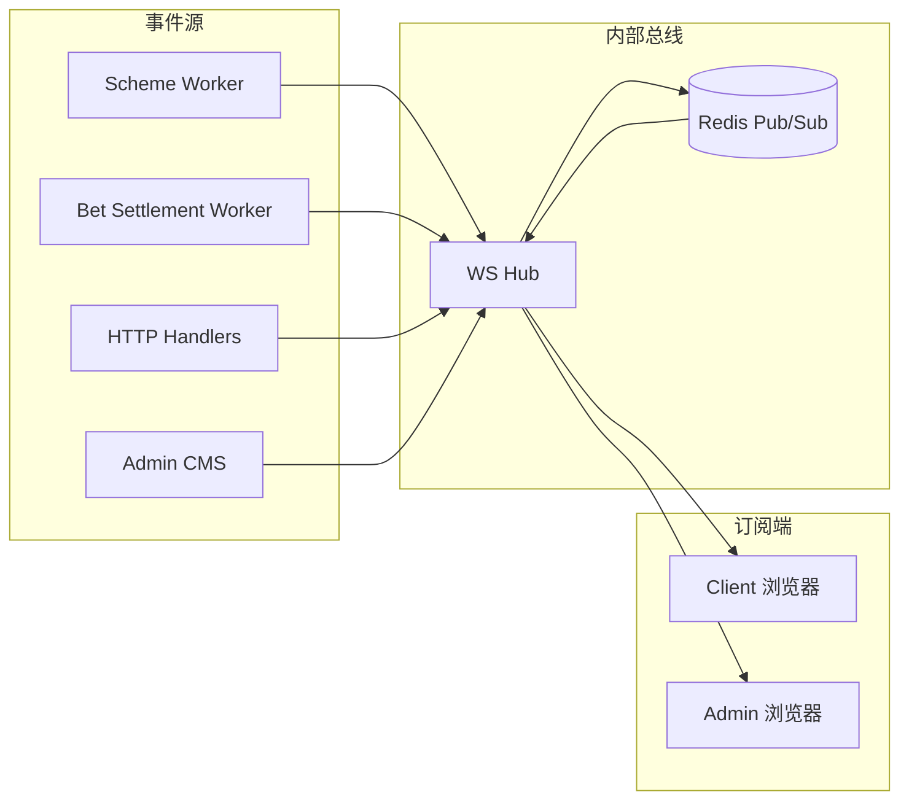

# WebSocket 实时推送方案（二期）

> **状态**：WS-1～WS-5 已落地  
> **关联**：[`integration-plan.md`](integration-plan.md) Phase 4/5 备注、[`openapi/openapi.yaml`](../openapi/openapi.yaml)（REST 仍为单一契约来源；WS 帧类型见本文 §5）

---

## 1. 背景与目标

### 1.1 现状

当前 Client / Admin 以 **REST + JSON** 为主；下列场景用 **定时轮询** 替代实时推送：

| 场景 | 现状 | 轮询间隔 | 代码入口 |
|------|------|----------|----------|
| 云端运行方案列表 | `GET /client/cloud/schemes/running` | 15s（WS 事件 + 降级轮询） | `useCloudRunningSync` |
| 全站维护开关 | `GET /public/maintenance` | 15s | `client/src/composables/useMaintenanceClient.ts` |
| 聊天会话 | `GET/POST .../chat/threads/{peerId}/messages` | 手动刷新 / 进入页拉取 | `client/src/api/chat/*` |
| 投注记录 / 钱包 | 按需 REST | — | 无轮询 |
| Admin 提现队列 / 方案监控 | 按需 REST | — | 运营手动刷新 |

`integration-plan.md` 约定：**聊天、方案状态** 为 WebSocket 首要受益域；Worker 产生的状态变更（暂停、结算、回头复位）目前仅落库 + 审计，**不会主动通知在线客户端**。

### 1.2 目标

1. **降低无效轮询**：云端方案、维护开关、聊天、钱包余额等改为 **事件驱动推送**。
2. **保持 REST 为事实来源**：OpenAPI 路径不变；WS 只推送 **增量事件** 或 **「请刷新 X」提示**，复杂聚合仍走 REST。
3. **可降级**：WS 不可用时 Client 自动回退现有轮询逻辑（`VITE_WS_ENABLED=false`）。
4. **可水平扩展**：多 `cmd/server` 实例时，通过 **Redis Pub/Sub**（或 NATS）广播，不要求 sticky session。
5. **双端隔离**：Client JWT 与 Admin JWT 分连接端点，Topic 权限模型不同。

### 1.3 非目标（本期 WS 不做）

- 第三方支付回调（仍 HTTP webhook）。
- Admin IM 全功能（占位页保持；WS-4 仅预留 `admin.chat.*` topic）。
- 二进制协议 / Protobuf（统一 JSON 帧）。
- 客户端离线消息长期存储（聊天仍靠 PostgreSQL + REST 补拉）。

---

## 2. 推送域与优先级



| 优先级 | Topic 域 | 事件示例 | 受益页面 | 阶段 |
|--------|----------|----------|----------|------|
| P0 | `public.maintenance` | 维护开/关、弹窗公告变更 | Client 大厅 | WS-1 |
| P0 | `client.scheme.instance` | 实例 paused/running/stopped、余额不足暂停 | 云端中心、投注记录 | WS-2 |
| P1 | `client.wallet` | 余额变更、充提状态 | 会员中心、充值/提现 | WS-2 |
| P1 | `client.cloud.bets` | 新投注明细、汇总变更提示 | 投注记录 | WS-2 |
| P2 | `client.chat.thread` | 新消息、未读数 | 聊天 Hub / 会话 | WS-3 |
| P2 | `client.chat.system` | 系统讯息 | 系统讯息 Tab | WS-3 |
| P3 | `admin.withdraw.queue` | 新提现单、审批状态 | 提现审批/出款 | WS-4 |
| P3 | `admin.scheme.monitor` | 强停、运行实例变更 | 方案监控 | WS-4 |
| P4 | `public.draw.{lotteryCode}` | 新开奖（可选） | 游戏详情倒计时 | WS-5 |

---

## 3. 连接与鉴权

### 3.1 端点

与 REST 同 host，路径挂在 `/api/v1` 下（便于复用 CORS 与反向代理）：

| 端点 | 鉴权 | 说明 |
|------|------|------|
| `GET /api/v1/ws/client` | Bearer JWT（`role=client`） | 会员/代理 |
| `GET /api/v1/ws/admin` | Bearer JWT（`role=admin`） | 管理端 |
| `GET /api/v1/ws/public` | 无（或可选匿名 session id） | 仅 `public.*` topic |

**握手**：标准 WebSocket Upgrade。

**Token 传递**（二选一，实现时固定一种并写进 `.env.example`）：

| 方式 | 说明 | 推荐 |
|------|------|------|
| Query `?token=` | 实现简单；注意代理日志可能泄露 | 开发环境 |
| 首帧 `auth` 消息 | 连接后 5s 内必须发送；否则 close `4001` | **生产推荐** |

JWT 校验复用 `internal/auth.Service.ParseBearer`；Claims 含 `sub`（account）、`role`、`adminRoleId`（Admin）。

### 3.2 连接生命周期

```
Client                    Server
  |---- WS Connect -------->|
  |<--- connected ----------|  (type: system.connected, connId)
  |---- auth {token} ------>|  (若未走 query)
  |<--- auth.ok ------------|
  |---- subscribe {topics}->|
  |<--- subscribed ---------|
  |<--- event ... ----------|  (推送)
  |---- ping -------------->|
  |<--- pong ----------------|
```

| Close Code | 含义 |
|------------|------|
| 4001 | 未鉴权 / token 无效 |
| 4002 | 订阅无权限 |
| 4003 | 协议错误 |
| 1000 | 正常关闭 |

**心跳**：客户端每 **30s** 发 `ping`；服务端 **90s** 无任意 inbound 帧则断开。

**重连**：指数退避 `1s → 2s → … → 30s`；重连后 **重新 subscribe**；Client composable 维护 `lastEventId` 按 topic 去重（可选）。

---

## 4. 消息协议

### 4.1 帧结构

所有帧为 **UTF-8 JSON 文本**，最大 **64KB**（聊天正文过长走 REST 发送，WS 只推摘要）。

```typescript
// contracts/ws.ts（建议新增，与 openapi 并列）
interface WsEnvelope {
  /** 帧类型 */
  type: 'system' | 'command' | 'event' | 'error'
  /** 命令或事件名，如 subscribe / client.scheme.instance.updated */
  name: string
  /** 关联 topic（事件帧必填） */
  topic?: string
  /** 服务端单调递增事件 id（可选，用于 gap 检测） */
  eventId?: string
  /** ISO8601 */
  ts: string
  payload?: unknown
}
```

### 4.2 Client → Server 命令

| name | payload | 说明 |
|------|---------|------|
| `auth` | `{ accessToken: string }` | 首帧鉴权 |
| `subscribe` | `{ topics: string[] }` | 批量订阅 |
| `unsubscribe` | `{ topics: string[] }` | 取消订阅 |
| `ping` | `{}` | 心跳 |

### 4.3 Server → Client 系统帧

| name | 说明 |
|------|------|
| `system.connected` | `{ connId, serverTime }` |
| `system.auth.ok` | `{ account, roleId? }` |
| `system.subscribed` | `{ topics: string[] }` |
| `system.pong` | — |
| `system.error` | `{ code, message }` |

### 4.4 事件帧示例

**维护开关（public，无需登录）**

```json
{
  "type": "event",
  "name": "public.maintenance.changed",
  "topic": "public.maintenance",
  "ts": "2026-05-28T08:00:00.000Z",
  "payload": {
    "enabled": true,
    "title": "系统维护",
    "message": "预计 30 分钟",
    "popupAnnouncementId": "ann-maint-1"
  }
}
```

**方案实例状态（client，仅推送给实例所属 member）**

```json
{
  "type": "event",
  "name": "client.scheme.instance.updated",
  "topic": "client.scheme.instance",
  "ts": "2026-05-28T08:00:01.000Z",
  "payload": {
    "instanceId": "42",
    "runMode": "real",
    "status": "paused",
    "reason": "insufficient_funds",
    "hint": "refresh_running_list"
  }
}
```

**聊天新消息（client）**

```json
{
  "type": "event",
  "name": "client.chat.thread.message",
  "topic": "client.chat.thread:agent-001",
  "payload": {
    "peerId": "agent-001",
    "messageId": "991",
    "preview": "您好，有什么可以帮您？",
    "sentAt": "2026-05-28T08:00:02.000Z"
  }
}
```

> **原则**：payload 保持 **小**；完整消息体仍 `GET /client/chat/threads/{peerId}/messages`。

**Admin 仪表盘 KPI（充值到账等）**

```json
{
  "type": "event",
  "name": "admin.dashboard.kpi.changed",
  "topic": "admin.dashboard.kpi",
  "ts": "2026-05-28T08:00:03.000Z",
  "payload": {
    "metric": "todayRecharge",
    "orderNo": "RC202605281200000001",
    "amount": 1000,
    "action": "recharge_paid",
    "hint": "refresh_kpi"
  }
}
```

---

## 5. Topic 命名与 ACL

格式：`{scope}.{domain}[.{param}]`

| Topic | 订阅者 | ACL 规则 |
|-------|--------|----------|
| `public.maintenance` | 所有人 / public 连接 | 无鉴权可读 |
| `public.draw.{lotteryCode}` | 所有人 | 无鉴权可读 |
| `client.scheme.instance` | Client | JWT `sub` 对应 member 的实例 |
| `client.wallet` | Client | 仅本人 member_id |
| `client.cloud.bets` | Client | 仅本人；可带 query `mode=real\|sim` |
| `client.chat.thread:{peerId}` | Client | 仅会话参与者 |
| `client.chat.system` | Client | 仅本人 |
| `admin.withdraw.queue` | Admin | `menuPaths` 含 `/funds/withdraw-*` |
| `admin.scheme.monitor` | Admin | 含 `/schemes/monitor` |
| `admin.dashboard.kpi` | Admin | 含 `/dashboard` |

服务端 **不信任客户端 filter**：订阅 `client.chat.thread:xyz` 时，Hub 校验该 member 是否有权访问 `xyz`。

Admin topic 校验：连接时缓存 `adminRoleId`，对照 `admin_roles.menu_paths`（与 HTTP RBAC 同源）。

---

## 6. 服务端架构（Go）

### 6.1 目录建议

```
backend/internal/ws/
  hub.go           # 连接注册、topic 路由
  conn.go          # 读写 goroutine、心跳
  auth.go          # 握手鉴权
  topics.go        # ACL
  publish.go       # Publish(topic, event) 供 worker/handler 调用
  redis_bus.go     # 多实例广播（可选开关）
  handler.go       # HTTP Upgrade 入口
```

### 6.2 与现有组件集成

| 事件源 | 集成点 | 发布时机 |
|--------|--------|----------|
| Scheme Worker | `internal/schemes/worker.go` | 实例状态变更、余额不足 pause、回头复位 |
| Settlement Worker | `orders/bets/settlement_worker.go` | 订单 settled → 推 `client.wallet` + 可选 `client.cloud.bets` hint |
| HTTP 启停实例 | `handler/cloud.go` | start/pause/resume 成功后 Publish |
| Admin 维护 | `handler/admin_maintenance.go` | PUT 成功后 `public.maintenance.changed` |
| Admin 提现审批 | `handler/admin_withdraw.go` | approve/reject/paid → `admin.withdraw.queue` |
| Demo 充值到账 | `handler/funds.go` RechargeSubmit | `admin.dashboard.kpi`（metric=todayRecharge） |
| 聊天 REST | `handler/content.go` SendChatMessage | 落库后推 thread topic |
| Admin 系统讯息 | `handler/admin_system.go` SendSystemMessage | 落库后推 `client.chat.system` |
| 开奖入库 | `schemes/draw_api.go`、`worker_draw.go` | 新开奖 `public.draw.result` |

**Publish API（进程内）**：

```go
// internal/ws/publish.go
func Publish(ctx context.Context, topic string, env Envelope) error
```

单实例：直写 Hub。多实例：`REDIS_URL` 配置时同时 `PUBLISH caipiao:ws` + 本地 Hub。

### 6.3 配置项（`.env`）

```env
WS_ENABLED=true
WS_REDIS_URL=              # 空 = 单实例内存 Hub
WS_MAX_CONNECTIONS=10000
WS_AUTH_VIA_FIRST_FRAME=true
```

---

## 7. 前端接入

### 7.1 环境变量

```env
# client/.env.local
VITE_WS_BASE_URL=ws://127.0.0.1:8080/api/v1/ws/client
VITE_WS_ENABLED=true
```

Admin 同理 `/ws/admin`；大厅维护可用 `/ws/public`（无需 token）。

### 7.2 Composable 分层

```
client/src/composables/ws/
  useWsClient.ts          # 连接、重连、subscribe 管理
  useWsTopic.ts           # 单 topic 订阅 + onEvent
  useCloudRunningWs.ts    # 替代/增强 useCloudRunningPoll
  useMaintenanceWs.ts     # 替代 15s 轮询
  useChatThreadWs.ts      # 会话页
```

**降级策略**：

```typescript
if (!WS_ENABLED || wsState === 'failed') {
  startCloudRunningPoll(...) // 现有 REST 轮询
}
```

### 7.3 与 Pinia / 页面协作

| 事件 | 页面行为 |
|------|----------|
| `client.scheme.instance.updated` | 云端中心：patch 本地列表项或 `fetchRunningSchemes` 单路刷新 |
| `client.wallet.updated` | 更新 header 余额；充值/提现页 toast |
| `public.maintenance.changed` | 复用 `useMaintenanceClient` 状态，立即弹窗 |
| `client.chat.thread.message` | Hub 未读 +1；会话页 append 或 pull latest |

Admin：`admin/src/composables/ws/useAdminWs.ts`，提现/方案监控页监听 queue 事件后 `ElNotification` + 列表 refresh。

---

## 8. 分阶段实施

| 阶段 | 交付 | 替换的轮询 | 预估 |
|------|------|------------|------|
| **WS-1** | Hub + auth + heartbeat + `public.maintenance` + Client composable | `useMaintenanceClient` 15s 轮询 | ✅ |
| **WS-2** | Worker/Handler 发 `client.scheme.instance` + `client.wallet`；云端中心接入 | `useCloudRunningSync` 事件 + 15s 降级轮询 | ✅ |
| **WS-3** | 聊天 thread/system 推送；REST 发送后 fan-out | 聊天手动刷新 | ✅ |
| **WS-4** | Admin 提现队列 + 方案监控 | Admin 手动刷新 | ✅ |
| **WS-5** | 开奖 `public.draw.*`（可选） | GameDetail 纯前端倒计时校准 | ✅ |

每阶段完成后更新 `integration-plan.md` 对应行，并在 `contracts/ws.ts` 登记事件类型。

---

## 9. 非功能需求

| 项 | 约定 |
|----|------|
| 顺序 | 同一 topic **不保证** 全局有序；客户端以 REST 为准做最终一致 |
| 幂等 | `eventId` 去重；无 eventId 时以 `name+ts+payload 摘要` 去重 |
| 背压 | 单连接 outbound 缓冲 **256 帧**，满则 drop 低优先级（如 kpi tick）并记 metric |
| 安全 | 禁止订阅 `client.*` 于 admin 连接；WSS 生产必须 TLS |
| 观测 | 日志：`ws.connect/disconnect/subscribe`；指标：连接数、publish lag、drop count |
| 测试 | `hub_test.go` 单元测试 + 可选 `wscat` 联调脚本 |

---

## 10. 待定项

| # | 问题 | 建议 |
|---|------|------|
| W1 | 是否需要 STOMP/Socket.IO 兼容 | **否**，原生 WS + JSON，前端自研 composable |
| W2 | 聊天是否 WS 上行（发送） | **否**，发送仍 `POST` REST；WS 仅下行推送 |
| W3 | 多 Tab 同账号 | 每 Tab 独立连接；或 SharedWorker 单连接（二期优化） |
| W4 | Redis 是否 Phase 0 必需 | **否**，单实例先内存 Hub；部署多副本前加 Redis |
| W5 | OpenAPI 是否描述 WS | REST 仍 OpenAPI；WS 用 `contracts/ws.ts` + 本文 |

---

## 11. 文档维护

- 新增事件：**先**更新本文 §4.4 与 `contracts/ws.ts`，再实现 Publish 与前端 handler。
- REST 行为不变；WS 仅为 **体验增强**，不得成为唯一数据源。
