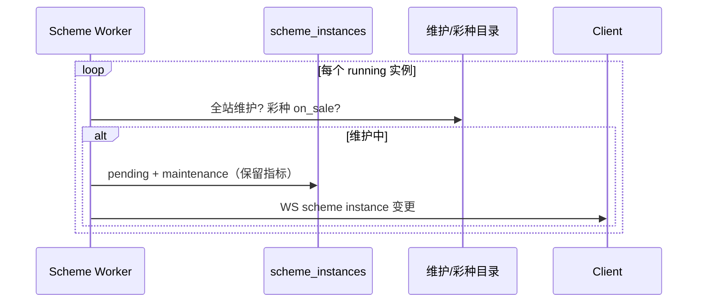
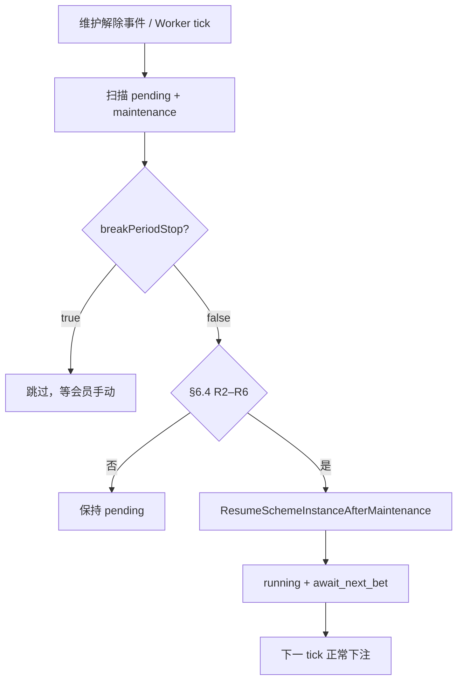

# 断期停投 — 实施方案（草案）

> **版本：v1.1（产品定案已录入）**  
> **状态**：Phase 1–4 已实现；待 §11 联调验收  
> **依据**：`backend/docs/modules/schemes.md` §6、`member_cloud_settings.break_period_stop`

---

## 文档索引

| 章节 | 内容 |
|------|------|
| [§1 目标与边界](#1-目标与边界) | 做什么 / 不做什么 |
| [§2 产品规则（定案）](#2-产品规则定案) | 开关含义、§6.4 |
| [§3 现状与缺口](#3-现状与缺口) | 已实现 / 未实现 |
| [§4 关键设计决策](#4-关键设计决策) | 续投 vs 新开、状态迁移 |
| [§5 数据模型](#5-数据模型) | 无新表，复用现有字段 |
| [§6 端到端流程](#6-端到端流程) | 停投 / 恢复 |
| [§7 Worker 设计](#7-worker-设计) | 检测、校验、自动续投 |
| [§8 触发时机](#8-触发时机) | tick / 维护变更 / 彩种上架 |
| [§9 API 与前端](#9-api-与前端) | 契约、文案、WS |
| [§10 阶段划分](#10-阶段划分) | Phase 0–3 |
| [§11 测试验收](#11-测试验收) | 清单 |
| [§12 已定案决策](#12-已定案决策) | Q1–Q4 产品确认结果 |
| [附录 C 定案速查](#附录-c-定案速查-q1q4) | 一页摘要 |

**相关文档**

- `backend/docs/modules/schemes.md` — 方案状态机 §6
- `backend/internal/schemes/worker_auto_pause.go` — 维护停投（已实现）
- `backend/internal/schemes/cloud_global_settings.go` — `breakPeriodStop` 读写
- `client/src/views/cloud/CloudCenterView.vue` — 开关 UI

---

## 1. 目标与边界

### 1.1 目标

将 **`breakPeriodStop`（断期停投）** 从「仅存储」接入 **Scheme Worker 维护恢复链路**，实现定案：

| `breakPeriodStop` | 维护解除后 |
|-------------------|------------|
| **关** `false` | 满足 §6.4 → **自动续投**（Worker 恢复 `running`） |
| **开** `true` | 保持 `pending` + `maintenance`，**会员手动**恢复 |

### 1.2 「断期停投」是什么

| 是 | 否 |
|----|-----|
| 彩种维护 / 全站维护导致 **停投** 后的 **恢复策略** | 投注窗口关闭、封盘 skip 本期 |
| 会员级全局开关（`member_cloud_settings`） | 方案级配置 |
| 与 `status_reason = maintenance` 联动 | 方案止损/止盈、总止损/止盈 |
| 维护解除后的 **自动 vs 手动** 分支 | 回头复位 |

### 1.3 不在范围（本方案）

- 修改维护 **停投** 本身（已实现：`checkAutoPause`）
- 投注记录「补开奖」Worker 改造（沿用现有 `payout_sync` / `settlement_worker`）
- Admin 按用户/代理线覆盖全局规则（Q50，暂缓）

---

## 2. 产品规则（定案）

来源：`backend/docs/modules/schemes.md` §6

### 2.1 停投触发（与开关无关）

以下情况 **一律停投**，**不读** `breakPeriodStop`：

1. **全站维护** `cms_maintenance.enabled = true`
2. **彩种维护** `lottery_catalog.sale_status != on_sale`

停投结果（**已实现**）：

```
running  ──PauseSchemeInstanceByWorker──▶  pending
         status_reason = maintenance
         保留 turnover / session_pnl / lookback_pnl / round_index 等
```

展示：**「因彩种维护关闭」**

### 2.2 恢复规则（§6.4 + 断期停投）

**公共前提（自动 / 手动均需满足）**

| # | 条件 |
|---|------|
| R1 | 实例 `status = pending` 且 `status_reason = maintenance`（或维护解除后仍为此原因） |
| R2 | 非 `soft_stopped` |
| R3 | 方案 **运行时间窗内**（`evaluateSchemeScheduleGate == OK`） |
| R4 | 未触 **方案** 止损/止盈（`schemelimits.Evaluate(session_pnl, config)`） |
| R5 | 正式盘未触 **总** 止损/止盈（`cloudlimits.Evaluate` 汇总正式 `session_pnl`） |
| R6 | 全站维护已关 **且** 该彩种 `sale_status = on_sale` |

**分支**

| `breakPeriodStop` | 维护解除后 |
|-------------------|------------|
| `false` | R1–R6 满足 → Worker **自动续投**（正式 / 模拟均适用，见 §12 Q3） |
| `true` | 不自动恢复；会员在云端中心 **手动开启**（走续投 SQL，保留指标，见 §12 Q1） |

**定案原文**

> 彩种维护：断期停投关 → 补开奖 + §6.4 满足则自动续投；开 → 手动恢复。

「补开奖」：依赖现有派奖/结算 Worker 追平；Scheme Worker 恢复 `running` 后，下注前已有 `hasUnsettledGuajiBet` 守卫，无需单独阻塞恢复 SQL。

### 2.3 与 D73 的边界

- 运营 **解封**（`soft_stopped → paused`）：**始终手动**恢复，不受 `breakPeriodStop` 影响。
- 手动 **暂停**（`running → paused`，`manual`）：**始终手动**开启，不受本方案自动恢复影响。

---

## 3. 现状与缺口

### 3.1 已实现

| 层级 | 说明 |
|------|------|
| DB | `member_cloud_settings.break_period_stop`，默认 `false` |
| API | `GET/PUT /client/cloud/global-settings` 读写 `breakPeriodStop` |
| Client | 云端中心开关 + 持久化 |
| Worker 停投 | `checkAutoPause` → 全站/彩种维护 → `pending` + `maintenance` |
| 展示 | `instanceStatusLabel` → 「因彩种维护关闭」 |

### 3.2 已实现（原缺口，Phase 1–4）

| 项 | 实现位置 |
|------|----------|
| Worker 读 `breakPeriodStop` + 自动续投 | `worker_maintenance_resume.go`、`maintenance_resume.go` |
| `ListMaintenanceStoppedInstances` + tick 扫描 | `scheme_instances.sql`、`worker.go` |
| `ResumeSchemeInstanceAfterMaintenance` + `StartInstance` 分支 | `instance_start.go`（维护续投跳过「开始时间须在未来」校验） |
| 全站维护关 / 彩种上架触发 | `admin_maintenance.go`、`admin_lottery_catalog.go`、`handler.go` |
| Client 开关说明 + 一键开启过滤 | `CloudCenterView.vue` |
| Admin 监控 `status_reason` | `admin.go` / `admin_schemes.sql` |

---

## 4. 关键设计决策

### 4.1 续投 vs 新开（**已定案：维护相关一律续投保留指标**）

| 路径 | SQL / 方法 | 指标 |
|------|------------|------|
| **维护自动续投**（`breakPeriodStop=false`） | `ResumeSchemeInstanceAfterMaintenance` | **保留** |
| **维护后手动「开启」**（`pending` + `maintenance`，含 `breakPeriodStop=true`） | 同上（**Q1-A**） | **保留** |
| **其它 pending / paused 手动「开启」** | `UpdateSchemeInstanceStatusFromPendingToRunning` | **清零**（新开一段） |

**理由**：维护停投时 `PauseSchemeInstanceByWorker` **不**清零指标；维护恢复（自动或手动）语义均为「接着跑」。

**`StartInstance` 改造要点**：若当前 `status_reason = maintenance`，调用 `ResumeSchemeInstanceAfterMaintenance`；否则走现有清零路径。

### 4.2 新 SQL：`ResumeSchemeInstanceAfterMaintenance`

```sql
-- 建议名：ResumeSchemeInstanceAfterMaintenance :one
UPDATE scheme_instances
SET status = 'running',
    status_reason = 'await_next_bet',
    bet_failed_detail = NULL,
    running_since = now(),
    updated_at = now()
WHERE id = $1
  AND status = 'pending'
  AND status_reason = 'maintenance';
```

**不修改**：`session_pnl`、`turnover`、`pnl`、`lookback_pnl`、`round_index`、`multiplier` 等。

恢复后走现有 tick：`ensureStartPeriodSkipped` / `tryActivateAfterStartPeriod` / 下注守卫。

### 4.3 全站维护 vs 彩种维护

| 类型 | 停投范围 | 恢复条件 |
|------|----------|----------|
| 全站维护 | 所有彩种 running 实例 | 全站 `enabled=false` |
| 彩种维护 | 该 `lottery_code` 的 running 实例 | 该彩种 `sale_status=on_sale` |

恢复扫描时 **逐实例** 校验 R6：即使全站已开，某彩种仍维护中则 **该实例不恢复**。

### 4.4 `breakPeriodStop` 读取时机

- 按 **`member_id`** 读 `GetMemberCloudSettings`（与 `planMultiplier` 同路径）。
- 缓存：Worker tick 内按 `member_id` map 缓存，避免 N+1。

### 4.5 一键开启方案（**Q4 已定案**）

- **排除** `status_reason = maintenance` 的实例（无论 `breakPeriodStop` 开闭）。
- Client `enableAllSchemes` 筛选：`pending | paused` 且 **`statusReason !== 'maintenance'`**。
- 维护停投实例须 **单卡手动「开启」**（走 §4.1 续投 SQL）。

---

## 5. 数据模型

**无新表、无 migration**（**Q2 已定案：否**，不新增 `maintenance_stopped_at`）。

| 表 / 字段 | 用途 |
|-----------|------|
| `member_cloud_settings.break_period_stop` | 会员全局开关 |
| `scheme_instances.status` | `pending` = 停投态 |
| `scheme_instances.status_reason` | `maintenance` = 维护停投 |
| `cms_maintenance.enabled` | 全站维护 |
| `lottery_catalog.sale_status` | 彩种维护 |

---

## 6. 端到端流程

### 6.1 维护发生 → 停投（已实现）



### 6.2 维护解除 → 自动续投（已实现）



### 6.3 开关切换（运行中）

| 操作 | 行为 |
|------|------|
| 关 → 开 | 不主动停投；已 pending+maintenance 的 **不** 自动恢复 |
| 开 → 关 | 若维护已解除且 R1–R6 满足，**下一 tick** 尝试自动恢复 |

---

## 7. Worker 设计

### 7.1 新模块建议

文件：`backend/internal/schemes/worker_maintenance_resume.go`

```go
// 伪代码
func (w *Worker) tickMaintenanceResume(ctx context.Context) {
    rows := w.q.ListMaintenanceStoppedInstances(ctx, batchLimit)
    settingsCache := map[int64]cloudGlobalSettingsLite{}
    for _, inst := range rows {
        if w.isStillUnderMaintenance(ctx, inst) { continue }
        settings := w.cachedCloudSettings(ctx, inst.MemberID, settingsCache)
        if settings.BreakPeriodStop { continue }
        if !w.canResumeUnderSection64(ctx, inst) { continue }
        w.resumeAfterMaintenance(ctx, inst)
    }
}
```

### 7.2 §6.4 校验 `canResumeUnderSection64`

| 步骤 | 实现 |
|------|------|
| R2 | `status != soft_stopped`（查询已过滤 pending） |
| R3 | `evaluateSchemeScheduleGate(def.Config, now) == OK` |
| R4 | `!schemelimits.Evaluate(session_pnl, def.Config).hit` |
| R5 | 正式盘：`!cloudlimits.Evaluate(memberFormalSessionPnl, limits).hit` |
| R6 | `!siteMaintenance && lotteryOnSale(inst.LotteryCode)` |

### 7.3 与现有 tick 集成

```go
func (w *Worker) tick(ctx context.Context) {
    w.tickRunningInstances(ctx)      // 现有：下注 + 维护停投
    w.tickMaintenanceResume(ctx)     // 新增：维护恢复
}
```

### 7.4 审计与日志

- 成功自动恢复：`admin_audit_logs` 或结构化 slog（actor=`scheme-worker`, action=`maintenance_auto_resume`）
- 字段：`instanceId`, `memberId`, `lotteryCode`, `breakPeriodStop=false`

---

## 8. 触发时机

| 触发源 | 优先级 | 说明 |
|--------|--------|------|
| **Worker 周期 tick** | P0 必须 | 每 `SCHEME_WORKER_TICK_SEC` 扫描，兜底 |
| **全站维护关闭** | P1 建议 | `maintenance.Service.AdminSave(enabled=false)` 后异步触发一次 `tickMaintenanceResume` |
| **彩种 PATCH 上架** | P1 建议 | `sale_status: maintenance → on_sale` 后，按 `lottery_code` 过滤触发恢复 |
| **WS 推送** | P2 可选 | 恢复成功后复用现有 instance WS，Client 刷新卡片 |

**新 SQL**

```sql
-- name: ListMaintenanceStoppedInstances :many
SELECT ... FROM scheme_instances
WHERE status = 'pending'
  AND status_reason = 'maintenance'
ORDER BY updated_at ASC
LIMIT $1;
```

---

## 9. API 与前端

### 9.1 API

- **无新接口**；`breakPeriodStop` 已在 `CloudGlobalSettings`。
- OpenAPI：为 `breakPeriodStop` 补充 description（与 `totalSessionPnl` 同级注释风格）。

### 9.2 Client 文案（建议）

| 位置 | 文案 |
|------|------|
| 开关旁 hint | **开**：彩种/全站维护结束后，须手动开启方案。**关**：维护结束且未触止损止盈时，自动续投。 |
| 卡片 `maintenance` | 保持「因彩种维护关闭」；自动恢复后可变为「将在下期开始投注」 |

### 9.3 Admin

- 方案监控 Tab：可选展示「因维护停投 / 等待自动恢复」标签（P2）。

---

## 10. 阶段划分

| Phase | 内容 | 验收 |
|-------|------|------|
| ~~**0**~~ | ~~评审 §12 Q1–Q4~~ | ✅ 2026-06-24 已结案 |
| ~~**1**~~ | 新 SQL + `ResumeSchemeInstanceAfterMaintenance` + `StartInstance` 分支 + 单元测试 | ✅ |
| ~~**2**~~ | `tickMaintenanceResume` + §6.4 校验 + 读 `breakPeriodStop`（含 sim） | ✅ |
| ~~**3**~~ | Client 文案 + 一键开启过滤 + OpenAPI 注释 | ✅ |
| ~~**4**~~ | 维护/彩种变更主动触发 + Admin 监控 status_reason 展示 | ✅ |

---

## 11. 测试验收

### 11.1 自动续投（`breakPeriodStop = false`）

| # | 步骤 | 期望 |
|---|------|------|
| T1 | running 方案 + 彩种进维护 | `pending` + `maintenance`，指标不变 |
| T2 | 彩种恢复 `on_sale` | 自动 `running`，`session_pnl` **不变** |
| T3 | 维护期间触达方案止盈 | 恢复后 **不** 自动续投（R4） |
| T4 | 维护期间触达总止损（正式） | 正式实例 **不** 自动续投（R5） |
| T5 | 方案已过结束时间 | **不** 自动续投（R3） |
| T6 | 全站维护开→关 | 所有受影响实例按 R6 分批恢复 |

### 11.2 手动恢复（`breakPeriodStop = true`）

| # | 步骤 | 期望 |
|---|------|------|
| T7 | 维护解除 | 保持 `pending` + `maintenance` |
| T8 | 会员点「开启」 | `running`，`session_pnl` **不变**（续投 SQL） |
| T8b | 一键开启 | **不包含** maintenance 实例（Q4） |

### 11.3 开关切换

| # | 步骤 | 期望 |
|---|------|------|
| T9 | 维护中 开→关 | 维护未解除：仍 pending |
| T10 | 已 pending+maintenance，关→开 | 不自动恢复 |
| T11 | 已 pending+maintenance，开→关，且维护已解除 | 下一 tick 自动恢复 |

### 11.4 回归

- 手动暂停 / 止损止盈 / 余额不足 / 投注失败 路径 **不受影响**
- `checkAutoPause` 仍在 running tick **最前** 执行

---

## 12. 已定案决策

> 2026-06-24 产品确认：**1→A，2→否，3→是，4→否**

| # | 问题 | **定案** | 实现要点 |
|---|------|----------|----------|
| **Q1** | 维护后手动「开启」是否清零指标？ | **A — 续投保留指标** | `StartInstance` 对 `status_reason=maintenance` 走 `ResumeSchemeInstanceAfterMaintenance` |
| **Q2** | 是否新增维护停投/恢复时刻字段？ | **否** | 仅用 `updated_at` + 审计 / slog |
| **Q3** | 模拟盘是否同样自动续投？ | **是** | `sim_bet=true` 参与 `tickMaintenanceResume`；R5 总止损仍仅约束正式盘 |
| **Q4** | 一键开启是否包含 maintenance 实例？ | **否（不包含）** | `enableAllSchemes` 过滤掉 `statusReason === 'maintenance'` |

### 技术风险

| 风险 | 对策 |
|------|------|
| 恢复与停投同一 tick 竞态 | 先 `tickRunningInstances`（停投），再 `tickMaintenanceResume` |
| 大量实例同时恢复 | 批量 LIMIT + 分 tick |
| 误用 `StartInstance` 自动恢复 | Code review 禁止；仅调用新 SQL |

---

## 附录 A — 代码锚点

| 模块 | 路径 |
|------|------|
| 维护停投 | `backend/internal/schemes/worker_auto_pause.go` |
| 全局设置 | `backend/internal/schemes/cloud_global_settings.go` |
| 开启（清零） | `backend/internal/db/queries/scheme_instances.sql` → `UpdateSchemeInstanceStatusFromPendingToRunning` |
| 方案止损 | `backend/internal/schemelimits/` |
| 总止损 | `backend/internal/cloudlimits/` |
| 时间窗 | `backend/internal/schemes/instance_schedule_window.go` |
| Client 开关 | `client/src/views/cloud/CloudCenterView.vue` |

## 附录 B — 名词对照

| 中文 | 字段 / 常量 |
|------|-------------|
| 断期停投 | `breakPeriodStop` / `break_period_stop` |
| 维护停投 | `status=pending`, `status_reason=maintenance` |
| 自动续投 | Worker `ResumeSchemeInstanceAfterMaintenance` |
| §6.4 | 时间窗 + 未触达各类止损止盈 |

## 附录 C — 定案速查（Q1–Q4）

```
Q1  手动恢复 maintenance  →  续投 SQL，保留 session_pnl / turnover / lookback 等
Q2  新字段                  →  不要
Q3  模拟盘自动续投          →  要（与正式共用 breakPeriodStop）
Q4  一键开启含 maintenance  →  不要（单卡手动开）
```

---

## 变更记录

| 日期 | 说明 |
|------|------|
| 2026-06-24 | v1 草案：梳理定案、缺口、Worker 设计与阶段划分 |
| 2026-06-24 | v1.2：Phase 4 — 维护/彩种上架主动触发续投；Admin 监控展示 maintenance 状态标签 |
