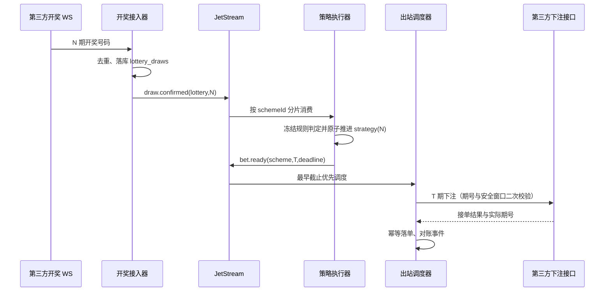

# 云端方案事件驱动下注架构设计

## 1. 目标与边界

本设计用于正式盘云端方案，尤其是 3 秒、6 秒、15 秒等短周期彩种。

目标：

- `N` 期开奖号码确定后，`N+1` 期下注必须使用 `N` 期已经完成的方案策略状态（倍率、轮次、出号游标）。
- 不向临近封盘的期号出站，且第三方接单期必须与本地目标期一致。
- 不依赖“方案数 × 每秒轮询”的数据库与第三方请求模型；单个方案或彩种异常不得阻塞其他方案。
- 面向每天至少 500 万正式注单，支持短周期边界的突发流量。

不可突破的物理边界：若第三方在 `N+1` 期安全截止时间后才提供 `N` 期开奖结果，则无法同时做到“使用 N 的结果”“不临近封盘下注”“N+1 不缺期”。要把“不缺期”作为承诺，第三方必须满足结果时效 SLA，或提供可在结果到达后自动执行的条件下注能力。

## 2. 时序定义

对目标下注期 `T=N+1`：

- `draw(N)`：`N` 期开奖号码进入本平台的确认事件。
- `strategy(N)`：按冻结玩法规则完成本地命中判断，并原子推进方案实例的倍率、轮次、出号状态。
- `safeDeadline(T)`：`T` 的第三方封盘时间减去安全余量。安全余量初始取 1.2 秒，并根据第三方下单 p99 延迟压测调整。
- `place(T)`：仅在 `strategy(N)` 已提交且当前时间早于 `safeDeadline(T)` 时允许出站。



## 3. 核心原则

### 3.1 以开奖事件驱动，不以方案轮询驱动

每个彩种的开奖号码只接收、确认、发布一次。所有等待该结果的方案由同一事件扇出，不允许每个方案单独请求 WS、REST 结果或 periods 接口。

方案 worker 不再每秒扫描“上一期是否结算”。它只消费与自身相关的 `draw.confirmed` 和恢复事件。因此数据库工作量随“实际开奖数 + 实际方案下注数”增长，而不是随“运行方案数 × tick 次数”增长。

### 3.2 同一实例严格串行，不同实例充分并行

消息以 `schemeId` 为一致性键分片：

- 同一 `schemeId` 的 `N`、`N+1` 决策只能由一个顺序消费者处理。
- 不同 `schemeId` 可在不同进程、不同服务器并行处理。
- 方案状态更新使用条件版本号或行锁，并以数据库唯一键兜底；消息至少一次投递不会造成重复推进或重复下注。

### 3.3 决策和出站解耦

策略计算属于本地 CPU/数据库短事务；第三方下注属于不可靠网络 I/O。两者必须分离：

1. `strategy(N)` 在事务内完成状态推进并写入 `bet.ready(T)` 事务消息。
2. 事务提交后才由出站调度器调用第三方。
3. 出站失败、超时、接单期不一致均进入可重试/对账流程，不回滚已经确定的策略决策。

## 4. 组件划分

| 组件 | 职责 | 扩展方式 |
| --- | --- | --- |
| 开奖接入器 | 维护每彩种 WS、规范化结果、去重落库、发布确认事件 | 按彩种分片，多副本热备但同一彩种仅一个活跃消费者 |
| 结果兜底器 | WS 缺失时按彩种合并 REST 查询；不按方案查询 | 每彩种单飞请求与退避 |
| 策略执行器 | 读取冻结规则、推进倍率/轮次/出号状态、写出站任务 | 按 `schemeId` 哈希消费者组扩容 |
| 出站调度器 | 依据安全截止时间、账号限额和第三方配额发单 | 按第三方账号与彩种分区，有限并发 |
| 结算对账器 | 以第三方资金与派彩为准，补齐财务状态并记录本地判定差异 | 独立低优先级队列，不能抢占出站资源 |
| 管理诊断 | 展示结果链路、策略状态、出站截止、第三方错误和积压 | 只读查询与指标汇总 |

消息总线使用 NATS JetStream：至少一次投递、持久化消费者、按主题保留、故障后可恢复。建议主题：

```text
draw.confirmed.<lotteryCode>.<period>
strategy.ready.<schemeShard>
bet.ready.<accountShard>
bet.reconcile.<accountShard>
```

## 5. 数据一致性与幂等

现有 `scheme_strategy_evaluations(instance_id, period_no)` 和 `cloud_bet_records(scheme_id, period_no)` 唯一约束继续作为关键幂等边界。新增实现应补充以下持久化对象：

| 对象 | 唯一键 | 用途 |
| --- | --- | --- |
| `scheme_period_decisions` | `(scheme_id, source_period_no)` | 记录 `N` 期策略已按哪个规则版本、哪个状态版本完成 |
| `scheme_bet_outbox` | `(scheme_id, target_period_no)` | `N` 的策略完成后生成 `N+1` 出站任务，包含 deadline、内容快照、倍率、轮次 |
| `scheme_bet_attempts` | `(outbox_id, attempt_no)` | 记录第三方请求、耗时、实际接单期和失败原因 |

策略事务必须同时完成：

1. 锁定或 CAS 更新方案实例状态；
2. 写 `scheme_strategy_evaluations` / `scheme_period_decisions`；
3. 写唯一的 `scheme_bet_outbox(T)`；
4. 提交后发布 outbox 事件。

如果发布消息失败，outbox 扫描器只补发尚未投递的任务；不重新计算策略。第三方接单前后均保留本地 claim，接单成功后的记录写入不可删除。

## 6. 截止时间与“不漏期”机制

### 6.1 正常路径

以 6 秒彩为例：`draw(N)` 通常在边界后 0.5–1.2 秒进入本地。策略判定与 outbox 写入应在 100ms 量级完成，出站任务仍有约 3 秒以上安全窗口。此时 `N+1` 的下注既使用 `N` 结果，又不会临近封盘。

### 6.2 WS 缺失兜底

- 到达 `drawFallbackAt` 后，由结果兜底器对该彩种发起一次合并 REST 查询；多个方案共用结果。
- 兜底请求有严格超时和单飞锁，不允许因为方案数量放大请求量。
- REST 返回后仍走相同的 `draw.confirmed` 事件与策略链路。

### 6.3 截止前仍无结果

在 `safeDeadline(T)` 前结果仍不可用时，系统不得用旧倍率下注，也不得尝试跨期下注。该情况记录为 `target_unfulfillable_due_to_missing_draw`，包括：彩种、源期、目标期、WS 状态、REST 尝试、第三方错误、剩余时间和受影响方案数。

这不是普通“静默跳过”，而是第三方结果 SLA 事件。必须告警给开发运维并纳入第三方对账报表。

若业务要求绝对零缺期，必须在上线前与第三方确认以下任一能力：

- 结果在 `safeDeadline(T)` 前稳定可用的 SLA；或
- 支持绑定 `T` 期、在本平台接收 `N` 结果后才执行的条件下注/预留下注。

没有上述保证时，平台只能在“错用旧结果”和“安全不下注”之间选择，不能承诺三项约束同时成立。

## 7. 性能与容量设计

500 万注/日平均约为 58 注/秒，但短周期彩种会产生边界突发，容量按峰值而非均值设计。

### 7.1 资源预算

- 下注、策略、结算均拆分队列和线程池；结算绝不占用临近 deadline 的出站并发。
- 出站采用最早截止优先（EDF）队列，并按第三方账号、彩种、全局分别设置令牌桶和最大并发。
- 并发度由压测得出的第三方 p95/p99 延迟与限频决定，禁止无限 goroutine。
- 单实例决策只访问实例状态、冻结规则和目标期 outbox；避免扫描历史注单。
- 当前期号、封盘时间和开奖结果保留在进程/Redis 共享缓存；缓存失效只触发每彩种一次刷新。

### 7.2 PostgreSQL

每笔正式下注至少涉及方案状态、投注流水、订单/账本、策略记录等多个写入。500 万注/日会形成千万级日写入，应实施：

- `cloud_bet_records`、`bet_orders`、账本明细按日期分区；热数据与历史归档分离。
- 交易查询使用精确主键或有限时间范围索引；报表、榜单、历史统计从聚合表或分析库读取。
- 用批量 outbox 拉取与批量写入降低往返；不在下单热路径执行大范围 JOIN、全文统计或历史回放。
- 事务保持短小：不把第三方 HTTP 调用放进数据库事务。

### 7.3 Redis 与 NATS

- Redis 用于共享期号快照、短生命周期去重、限流计数和 worker 心跳；数据库仍是最终事实。
- JetStream 持久化业务事件，消费者可水平扩容；按方案哈希保证顺序，按账号隔离第三方限流。
- 消息积压、最早任务剩余 deadline、WS 延迟、REST 兜底率、第三方 p99 延迟均需实时指标化。

## 8. 集群部署

建议分离以下服务，避免 API、下单、结算互相抢占：

```text
负载均衡
  ├─ API / WebSocket 网关（无状态，多副本）
  ├─ 开奖接入器（按彩种选主）
  ├─ 策略执行器（schemeId 分片消费者组）
  ├─ 第三方出站调度器（账号/彩种分片、EDF）
  └─ 结算与对账器（独立低优先级消费者组）

NATS JetStream 集群（至少 3 节点）
PostgreSQL 主库 + 只读副本/备份 + 分区归档
Redis 高可用集群
```

常用高频彩种可由独立的开奖接入器、策略消费者和出站配额处理；其他彩种共享低优先级资源。所有服务通过消息总线交互，不需要为每个用户或方案分配常驻进程。

## 9. 可观测性与告警

管理员诊断至少展示：

- `draw(N)` 的第三方时间、接收时间、入库时间和 WS/REST 来源；
- `strategy(N)` 的规则快照、开始/完成时间、命中结果、状态版本；
- `bet.ready(T)` 的创建时间、deadline、队列位置、出站尝试和实际接单期；
- 当前彩种 WS 连接状态、结果兜底次数、第三方 HTTP 错误分类；
- 因结果 SLA 超时导致无法满足目标期的方案数量与期号。

关键 SLO：

- `draw -> strategy committed` p99；
- `strategy committed -> third-party accepted` p99；
- 安全截止前完成率；
- 第三方接单期一致率；
- 每彩种消息积压、任务过期数和重试数。

## 10. 分阶段实施与验证

1. **观测阶段**：不改变下单，建立 draw、策略、出站时延和 deadline 指标，并用历史与实时镜像计算验证时序。
2. **Outbox 阶段**：实现幂等策略决策与出站任务表，但仅影子消费，不发送真实下注。
3. **单彩种灰度**：先在 6 秒彩的一小部分实例启用事件驱动，旧 worker 仅保留只读监控；验证不跨期、倍率逐期推进和第三方一致率。
4. **高频彩种扩容**：依据真实 p99 延迟、账号限频和峰值队列长度配置消费者与出站并发。
5. **全面切换**：按彩种逐步关闭轮询下单路径；保留只读诊断与可回滚开关。

验收必须包含：同一方案连续中/未中、结果延迟、WS 断线、REST 超时、第三方接单期变化、消息重复投递、worker 宕机恢复、数千方案同一边界并发，以及 500 万注/日等效压力测试。

## 11. 本次决定

本轮未提交“轮询栅栏”代码。该版本已从工作区撤回。后续实现以本文的事件驱动 outbox 方案为准，不再继续扩展每秒轮询等待逻辑。

## 12. 实施前必须冻结的正确性约束

本节是正式盘实现的强制约束；若与前文的概念性描述冲突，以本节为准。任何绕过这些约束直接调用第三方下注接口的实现均不允许上线。

### 12.1 目标期号只能来自第三方期历，禁止本地期号加一

`T=N+1` 仅是正常连续期号下的业务记号，**不是**可执行的期号计算公式。第三方可能补期、断期、调整期号或返回与本地时钟不同的开放窗口，因此必须建立不可变的 `period_snapshot`：

- 主键为 `(lottery_code, provider_period_no)`，保存第三方返回的开始时间、封盘时间、原始响应摘要、获取时间与期历版本；
- 对某个 `draw(N)` 创建下注任务时，必须从同一份已确认期历中取得 `N` 的直接下一开放期 `T`；不得把字符串或数字期号直接 `+1`；
- 出站前必须再次确认 `T` 仍是第三方允许接受、且距封盘时间大于安全余量的期号；
- 任何“第三方实际接单期号不等于 `T`”均为终态 `accepted_wrong_period`：保留证据、停止该任务后续自动重试，并触发告警；绝不把它记为本地 `T` 的成功订单。

所有节点使用 NTP 同步时钟。`safeDeadline(T)` 由第三方 `close_at` 计算，并扣除时钟偏差预算、排队 p99、网络 p99 与第三方接单 p99；不得仅以固定 1.2 秒作为长期常量。

### 12.2 首期、连续链与缺期后的处理

“依据上一期开奖结果下注”只对连续下注链成立。方案启动时没有本方案的上一笔已结算注单，因此首期必须明确标记为 `initial_bet`，其选号和倍率只能来自方案初始配置，不能伪称为上一期策略结果。

后续每一个策略决策必须绑定一笔已被第三方接受、且对应开奖已确认的源注单：

```text
accepted bet(N) -> confirmed draw(N) -> strategy decision(N) -> candidate bet(T)
```

若 `candidate bet(T)` 在安全截止前未能确认接单，连续链被中断：

- 记录 `chain_interrupted` 及中断原因（缺开奖、队列超时、账户限频、第三方超时、余额不足或接错期）；
- 不得把 `T` 的开奖号码当作本方案已下注后的输赢来继续推进倍率、轮次或出号状态；
- 严格连续模式下方案进入 `blocked_requires_rearm`，仅由明确的重新开启动作创建新的 `initial_bet` 链；
- 若未来产品提供“允许缺期后自动续投”，必须作为单独的、显式配置的业务模式，并在详情和审计中标识为非连续策略，不能与严格连续模式混用。

这一定义避免“策略状态已推进、实际下注未成功”后继续以不存在的注单结果推进倍率。

### 12.3 出站状态机与未知接单的安全处理

`scheme_bet_outbox` 不只是一条待发送记录，必须保存外部副作用的完整状态。最低状态机如下：

```text
pending -> leased -> sent_unknown -> accepted
                  |                 -> rejected
                  |                 -> expired
                  -> cancelled
```

- `leased` 持久化 `lease_owner`、`lease_fencing_token`、`lease_until`；只有持有未过期 fencing token 的调度器可以发起请求；
- 请求发出前写入不可变 `request_id`、请求内容哈希、目标期号、金额、规则快照、倍率与轮次；同一任务的重试必须复用该 `request_id`；
- HTTP 超时、连接中断或进程在请求发出后崩溃时，任务必须先进入 `sent_unknown`，而不是立即创建新的尝试；
- 若第三方支持幂等键，`request_id` 必须作为其幂等键传递；若只支持注单编号查询，必须先用该编号对账；
- 在不能证明第三方未接单时，不允许自动再次发起相同下注。达到截止时间仍未知时记为 `external_acceptance_unknown` 并告警；
- 仅 `accepted` 才能写入正式 `cloud_bet_records` 成功态，且第三方返回的接单期号、金额与请求摘要必须同时校验。

因此，本地数据库唯一键只能防止本地重复建任务，不能单独证明“第三方恰好接收一次”。第三方没有幂等能力且没有可查询关联号时，系统不能承诺自动重试不重复下注。

### 12.4 同一方案的顺序执行与集群防双主

NATS JetStream 提供至少一次投递，不会自动把任意消费者组按 `scheme_id` 串行化。实施时必须固定以下拓扑：

- 以稳定散列将 `scheme_id` 映射到固定数量的 `strategy.ready.<shard>`；同一 shard 同一时刻只允许一个持久消费者持有处理租约；
- 消费者扩缩容、重平衡和故障切换必须通过 shard 租约 epoch 完成，旧 epoch 的写入由数据库 fencing token/CAS 拒绝；
- `scheme_period_decisions(scheme_id, source_period_no)` 的唯一键与 `scheme_instances.state_version` 的 CAS 是最终一致性边界；消息重复、乱序或重放不得重新推进状态；
- 开奖接入器按彩种选主也必须有领导者租约。重复接入可作为热备，但只允许一个领导者发布 `draw.confirmed`；
- 旧轮询 worker 与新 outbox 调度器在同一彩种灰度期间只能有一个拥有真实下注权限。另一个只能影子计算和只读观测。

### 12.5 开奖事件的不可变性、乱序与更正

`draw.confirmed` 至少包含：彩种、期号、开奖内容规范化结果、上游事件编号或原始报文哈希、来源（WS/REST）、第三方发生时间、本地接收时间和确认时间。

- 相同 `(lottery_code, period_no, draw_hash)` 只发布一次；重复消息只做幂等确认；
- 同一期出现不同 `draw_hash` 时，不覆盖已用于策略的开奖结果，也不重新执行策略；记录为 `draw_correction_detected` 并进入人工/对账流程；
- WS 重连必须从已确认期号检查缺口，并按彩种执行合并 REST 补拉；补拉结果仍通过同一入库、去重、发布路径；
- 策略消费者遇到缺少源注单、缺少期历或早于当前链条的开奖事件时只记录诊断，不得猜测补算。

### 12.6 扇出、容量准入与背压

单个 `draw.confirmed` 可能同时唤醒大量运行方案。开奖事件不能由每个方案自行订阅后无界并发处理；应由“活跃方案展开器”根据开奖时刻的运行实例快照，按彩种和 shard 分页投递 `strategy.ready` 任务。

方案开启前需要做容量准入，至少同时检查：

- 该彩种安全窗口内可用的策略吞吐与出站吞吐；
- 第三方账户、彩种与全局限频配额；
- 当前 JetStream 积压、outbox 临期任务数和可用 worker 数；
- 故障恢复时的最大重放量与磁盘保留量。

不足时应拒绝或延后开启，并返回明确的容量原因；不能在已经无法安全发单时继续无限接纳方案。调度器使用 EDF，但还必须保留账户级和租户级配额，避免某一账户的临期任务长期饿死其他账户。背压优先级为：保留开奖和已接单证据 > 保留临期出站 > 低优先级结算/报表；禁止为释放压力丢弃开奖事件或伪造成功。

### 12.7 规则、金额与资金事实的冻结边界

- 每个出站任务保存玩法规则版本、赔率/单挑规则快照、标准化投注内容、投注单位、倍率、金额截断规则和货币；后续规则发布不得改变历史任务的判定；
- 本地规则判定用于在安全窗口内推进策略；第三方返回的已接单金额、注单编号、派彩和资金流水是财务事实；
- 本地与第三方中奖或金额不一致时，记录 `strategy_finance_mismatch`，保留两侧快照并告警。不得通过修改历史策略记录来掩盖差异，也不得将未核实的第三方结果直接改写成新的策略输入；
- 所有正式下注，无论来自 API、方案 worker 还是人工补偿，都必须进入同一 outbox、同一幂等与审计链路。

### 12.8 安全、权限与保留策略

- NATS、Redis、PostgreSQL 与第三方调用均使用最小权限账户；生产消息总线启用 TLS、认证、subject 级发布/订阅权限；
- 下注消息、诊断日志和死信队列不得记录可复用第三方 token、明文凭证或完整敏感请求头；凭证仅由受控配置/密钥服务读取；
- 管理员诊断、人工重放、解除阻塞和重新开启必须具备角色权限、操作人、理由和不可修改审计记录；
- JetStream 三副本、PostgreSQL 副本和 Redis 高可用必须分布在独立故障域；同机“三节点”不计入高可用；
- 分区表提前创建、设置保留和归档策略，并为 outbox 恢复、方案详情、资金审计分别建立索引；资金账本的保留期限须满足审计要求，不能按普通日志直接清理。

### 12.9 上线验收的故障注入清单

除第 10 节已有场景外，灰度前必须自动化验证以下情形：

1. 第三方已接单但 HTTP 响应丢失；
2. 请求发出后、写入接单结果前，出站进程被强制终止；
3. JetStream 重复投递、乱序投递、消费者租约切换；
4. 两个策略节点同时尝试推进同一 `(scheme_id, period_no)`；
5. WS 断线、期号缺口、REST 补拉与同期开奖更正；
6. 本地时钟偏差、封盘时间变化、第三方接单到不同期号；
7. 账户限频、余额不足、第三方长时间不可用和恢复后的限速补偿；
8. 单彩种大量活跃方案在同一边界触发，并与 500 万注/日等效峰值压测；
9. 本地规则结果与第三方资金结算结果不一致。

验收标准不是“任务最终都完成”，而是每一场景都能证明：不重复下注、不把错误期号记为成功、不用不存在的上一期注单推进策略，并能在诊断中还原完整因果链。
