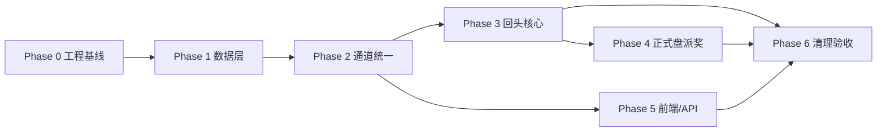

# 云端回头停止 + simBet 统一 — 细化实施方案

> **版本：v2 实施计划（梳理文档）**  
> **状态**：Phase 0–6 代码已落地；待 DB 应用 `00102` + §12 人工验收  
> **默认采纳**：T1-A（`applyFormal` + `applySim`）、T2-A（删除 `RunMode` 字符串类型）

---

## 文档索引

| 章节 | 内容 |
|------|------|
| [§1 目标与边界](#1-目标与边界) | 做什么 / 不做什么 |
| [§2 唯一参数 simBet](#2-唯一参数-simbet) | 废弃清单与同步规则 |
| [§3 回头设置（会员级）](#3-回头设置会员级) | 存储、UI、评估门槛 |
| [§4 回头停止（运行时）](#4-回头停止运行时) | 评估时机、复位动作 |
| [§5 数据模型](#5-数据模型) | 表、JSON、runtime |
| [§6 端到端流程](#6-端到端流程) | 流程图 |
| [§7 业务规则明细](#7-业务规则明细) | 个别 / 整体 |
| [§8 API 与前后端变更](#8-api-与前后端变更) | 接口、模块、前端 |
| [§9 阶段总览与进度](#9-阶段总览与进度) | Phase 0–6 |
| [§10 Phase 0 工程基线](#10-phase-0-工程基线) | sqlc、migration、编译修复 |
| [§11 Phase 1–6 实施步骤](#11-phase-16-实施步骤) | 可验收小步 |
| [§12 测试验收](#12-测试验收) | 清单 |
| [§13 风险与对策](#13-风险与对策) | |
| [附录 A 已定稿决策](#附录-a-已定稿决策速查) | |
| [附录 B 名词对照](#附录-b-名词对照) | |

**相关文档**

- `backend/docs/sqlc-schema.md` — sqlc schema 维护说明
- `backend/docs/modules/schemes.md` — 方案模块（§15.4 回头）
- `backend/migrations/00101_lookback_sim_bet.sql` — 回头 simBet migration
- `backend/cmd/apply-lookback-sim-bet/` — 手工补应用 00101

---

## 1. 目标与边界

### 1.1 目标

1. **回头停止**：将会员在「云端中心 → 回头设置」中的规则，完整作用于挂机过程中的「倍投 + 出号进度复位」。
2. **通道统一**：废弃 `run_mode` / `config.runMode(prod/sim)` / `real|sim` 字符串体系，**全项目只保留 `simBet: boolean` 表达正式/模拟**。

### 1.2 「回头停止」是什么

| 是 | 否 |
|----|-----|
| 倍投轮次回第 1 轮 | 暂停方案（pause） |
| 出号游标复位 | 方案止盈/止损停投 |
| `lookback_pnl` 清零 | 云端总止盈/总止损 |
| 方案保持「正在云端挂机中」 | 撤销/重算触发当期注单 |

### 1.3 不在范围

- 方案级 `stopLoss` / `takeProfit` → pause
- 云端总 `totalStopLoss` / `totalTakeProfit` → 停全部 running
- 维护停投、余额不足、手动停止

---

## 2. 唯一参数：simBet

### 2.1 定义

```
simBet: boolean
  false  →  正式运行（第三方真单）
  true   →  模拟运行（本地模拟 eval，永不走第三方）
```

### 2.2 废弃清单

| 废弃 | 替代 |
|------|------|
| `scheme_instances.run_mode` | `sim_bet` |
| `config.runMode`（prod/sim） | `config.simBet` |
| `cloud_bet_records.run_mode` | `sim_bet` |
| `member_lookback_runtime.run_mode` | `sim_bet`（PK 一部分） |
| `member_lookback_settings.run_mode`（逗号串） | `apply_formal` + `apply_sim` |
| API `runMode` / `runModes`（实例通道） | `simBet` |
| `RunMode = 'real'\|'sim'` 类型 | `boolean` |
| `mapClientRunMode` / `cloudBetRunMode` 等 | 直接使用 `simBet` |

### 2.3 同步规则（已定稿）

| 场景 | 规则 |
|------|------|
| 方案编辑改「正式/模拟」 | 写 `config.simBet`；同步该 definition 下**全部非 running** 实例 |
| 云端卡片「模拟投注」开关 | 写实例 `sim_bet`；同步 `config.simBet` |
| **`status=running`** | **禁止**改 simBet（UI disabled + API 409） |
| 加云 | `sim_bet = config.simBet`（默认 `false`） |
| 冲突回填 | 迁移时 **`sim_bet` 优先**于旧 `run_mode` |

---

## 3. 回头设置（会员级）

### 3.1 存储字段

```typescript
// member_lookback_settings（示意）
{
  applyFormal: boolean,   // 正式通道(simBet=false)是否启用回头
  applySim: boolean,      // 模拟通道(simBet=true)是否启用回头
  judgment: '' | 'individual' | 'overall',  // 互斥，可都不选

  // 个别判断
  singleProfitThreshold: number,
  singleLossThreshold: number,

  // 整体判断
  overallProfitThreshold: number,
  overallLossThreshold: number,
  schemeWinsMin: number,
  schemeWinsMax: number,
  periodProfit: number,
  periodLoss: number,
}
```

- 阈值 `0` = 不启用该侧
- `judgment` 为空 → 永不评估回头
- `applyFormal` / `applySim` 可都不选 → 永不评估

### 3.2 UI 规则

- **运行模式多选**：对应 `applyFormal` / `applySim`（非实例通道本身）
- **个别/整体判断**：互斥，可都不选
- **提示文案**：仅显示「个别判断 / 整体判断 / 未选择判断方式」，不展示阈值细节

### 3.3 评估门槛

```
实例 simBet=false  →  需 applyFormal=true
实例 simBet=true   →  需 applySim=true
且 judgment 非空
→ 才进入回头评估
```

---

## 4. 回头停止（运行时）

### 4.1 评估时机

| simBet | 触发点 | pnl / hit 来源 |
|--------|--------|----------------|
| `true`（模拟） | Scheme Worker **下注成功后** | 本地 `evaluatePlayHit` |
| `false`（正式） | **PayoutSync 派奖同步成功后** | 第三方真实 pnl / 赛果 |

### 4.2 触发后的效果（Q7 已定稿）

**产品语义：「这一期照常结算，从下一期起重新从第 1 轮开始跑。」**

| 对象 | 触发当期 | 下一期起 |
|------|----------|----------|
| 已下/已结算注单 | **不变** | — |
| `round_index` | — | → `0`（第 1 轮） |
| 出号游标 | — | 复位（pick_index / current_pick / last_direction） |
| `lookback_pnl` | — | → `0` |
| `status` | 保持 `running` | 保持 `running` |
| `session_pnl` / `pnl` | 不变 | 不变 |

### 4.3 个别 vs 整体

| 类型 | 累计字段 | 复位范围 |
|------|----------|----------|
| **个别** `individual` | 单方案 `lookback_pnl` | 仅触发方案 |
| **整体** `overall` | `member_lookback_runtime`（会员 + simBet） | 同会员、同 simBet、**全部 running** 方案 |

整体复位时 **非触发方案也一并** `round_index→0`。

---

## 5. 数据模型

### 5.1 方案配置（definition JSON）

```json
{ "simBet": false }
```

- 方案编辑「正式运行 / 模拟运行」直接绑定此字段
- 旧 `runMode: prod/sim` 迁移：`prod→false`，`sim→true`

### 5.2 方案实例（`scheme_instances`）

| 列 | 说明 |
|----|------|
| `sim_bet` | **唯一通道字段** |
| `lookback_pnl` | 个别判断累计 |
| `round_index` | 倍投轮次 |
| `pick_index` / `current_pick` / `last_direction` | 出号游标 |

删除：`run_mode`（最终阶段）

### 5.3 投注记录（`cloud_bet_records`）

- `sim_bet BOOLEAN` 替代 `run_mode`
- 写入时快照实例当时 `simBet`

### 5.4 回头 runtime（`member_lookback_runtime`）

主键：`(member_id, sim_bet)`

| 字段 | 用途 |
|------|------|
| `session_pnl` | 整体：跨方案累计盈亏 |
| `period_issue` | 单期统计期号 |
| `period_pnl` | 整体：单期内累计（换期清零） |
| `total_hit_count` | **新增**：跨期累计中奖次数（整体「几回头」） |

**跨期中奖**：同会员、同 simBet、所有 running 方案的中奖次数**合计**。  
**清零**：仅在该通道触发**整体回头复位**时清零。

---

## 6. 端到端流程

```
┌─────────────────────────────────────────────────────────┐
│                    会员回头设置                          │
│  applyFormal / applySim + judgment + 各阈值              │
└────────────────────────┬────────────────────────────────┘
                         │
         ┌───────────────▼───────────────┐
         │  方案实例 simBet + status=running │
         └───────────────┬───────────────┘
                         │
              applyFormal/applySim 匹配？
                         │ 否 → 结束
              judgment 非空？
                         │ 否 → 结束
         ┌───────────────┴───────────────┐
         │                               │
    simBet=true                    simBet=false
    Worker 下注后                   派奖同步后
    本地 pnl + hit                  真实 pnl + hit
         │                               │
         └───────────────┬───────────────┘
                         │
              ┌──────────▼──────────┐
              │ judgment=individual │ → lookback_pnl 达阈？
              │ judgment=overall    │ → runtime 达阈？
              └──────────┬──────────┘
                         │ 是
              ┌──────────▼──────────────────────────┐
              │ applyLookbackReset（同事务）           │
              │ · round_index→0, 出号复位             │
              │ · lookback_pnl→0                     │
              │ · 整体：同通道全部 running + runtime清零│
              │ · 审计日志                           │
              │ · 不 pause                           │
              └─────────────────────────────────────┘
                         │
              下一期按第 1 轮倍投、出号从初始状态继续
```

---

## 7. 业务规则明细

### 7.1 个别判断

- **累计：** `lookback_pnl`（与 `session_pnl` 独立）
- **更新：** 模拟=下注后；正式=派奖后
- **触发：** singleProfit / singleLoss 阈值
- **复位：** 仅本方案

### 7.2 整体判断

| 规则 | 累计 | 触发 |
|------|------|------|
| 整体盈亏 | `session_pnl` | overallProfit / LossThreshold |
| 单期盈亏 | 同期号 `period_pnl` | periodProfit / LossThreshold |
| 方案几回头 | **`total_hit_count`（跨期）** | `min ≤ count ≤ max` |

### 7.3 与方案止盈/止损的区别

| | 回头停止 | 方案止盈/止损 |
|--|----------|---------------|
| 触发后状态 | `running` | `pending`（pause） |
| 倍投轮次 | 回第 1 轮 | — |
| 依据字段 | `lookback_pnl` / runtime | `session_pnl` vs config 阈值 |

---

## 8. API 与前后端变更

### 8.1 核心 API

| 接口 | 变更 |
|------|------|
| `GET/PUT /client/cloud/lookback` | `runModes[]` → `applyFormal` + `applySim`（可保留 runModes 兼容一版） |
| `GET /client/cloud/instances` | `?runMode=` → `?simBet=` |
| `PUT .../instances/{id}/sim-bet` | running 时 409 |
| `PUT` 方案 definition | `runMode` → `simBet`；有 running 实例则拒绝改通道 |
| WS `SchemeInstance` | `runMode` → `simBet` |

### 8.2 后端模块

| 模块 | 职责 |
|------|------|
| `lookback` 包 | `AppliesTo(settings, simBet)`、`evaluateIndividual/Overall`、`applyReset` |
| `worker.go` | 模拟通道：下注后评估 + 复位 |
| `payout_sync.go` | 正式通道：派奖后更新 lookback_pnl/runtime + 评估 + 复位 |
| `worker_lookback.go` | 按 `(member_id, sim_bet)` 查 running、写 runtime |

### 8.3 前端

| 位置 | 变更 |
|------|------|
| 方案编辑页 | `runMode` → `simBet` |
| 云端卡片 | running 时 simBet 开关 disabled |
| 回头设置 | 运行模式 → `applyFormal/applySim`（UI 可不变，映射层改） |
| `client/src/api/types.ts` | `CloudLookbackSettings` 增 `applyFormal` / `applySim` |

---

## 9. 阶段总览与进度



### 当前进度（截至 v2 文档）

| 项 | 状态 |
|----|------|
| 产品规则定稿 | ✅ |
| `00101_lookback_sim_bet.sql` | ✅ 已写 |
| `00102_drop_run_mode.sql` | ✅ 已写（待应用） |
| `member_lookback*.sql` queries | ✅ |
| `sqlc.yaml` + sqlc generate | ✅ |
| `go build ./...` | ✅ |
| Worker 回头（sim 下注后 / 正式派奖后） | ✅ |
| simBet 通道 + definition 同步 | ✅ |
| 前端 client/admin simBet | ✅ |
| §12 人工 E2E 验收 | ⏳ 待测 |

**关键路径**：Phase 0 → Phase 1 → Phase 2.1 → Phase 3 → Phase 4 → Phase 6

---

## 10. Phase 0 工程基线

**目标**：sqlc 可重复生成，后端可编译。

### 10.1 sqlc schema

- 配置：`backend/sqlc.yaml`（按 goose 版本号列出 DDL migration）
- 特例 patch：`backend/internal/db/sqlc/patches/99_cms_promo_for_sqlc.sql`（00062 删表后 content.sql 仍需要）
- 命令：`cd backend && make sqlc`

### 10.2 删除重复 sqlc 生成文件（整文件）

路径：`backend/internal/db/sqlcdb/`

| 文件 | 原因 |
|------|------|
| `bet_orders_settled.sql.go` | 已合并进 `bet_orders.sql.go` |
| `bet_orders_settlement.sql.go` | 同上 |
| `cloud_bet_records_exists.sql.go` | 已合并进 `cloud_bet_records.sql.go` |
| `cloud_bet_records_insert.sql.go` | 同上 |
| `lottery_draws_worker.sql.go` | 已合并进 `lottery_draws.sql.go` |
| `scheme_definitions_worker.sql.go` | 已合并进 `scheme_definitions.sql.go` |
| `admin_member_ops.sql.go` | 已合并进 `members.sql.go` |
| `scheme_instances_page_ext.go` | 已合并进 `scheme_instances.sql.go` |
| `scheme_worker.sql.go` | 已合并进 `scheme_instances.sql.go` |

### 10.3 ext 文件去重（删方法，不删整文件）

**`cloud_limits_ext.go`** — 只保留类型：

```go
type PausedRunningInstance struct { ID, RunMode string }
```

删除：`SumMemberFormalSessionPnl`（已在 `scheme_instances.sql.go`）

**`worker_bet_ext.go`** — 删除与 sqlc 重复的方法：

- `LockSchemeInstanceForBet`（在 `scheme_instances.sql.go`）
- `UpdateCloudBetRecordFromSettlement`（在 `cloud_bet_records.sql.go`）

### 10.4 应用 migration

1. `00100` — judgment 允许空（若未应用）
2. `00101` — apply_formal/sim、runtime sim_bet/total_hit_count

```bash
go run ./cmd/apply-lookback-sim-bet/
# 或 goose migrate up（注意 00098 重复编号问题）
```

### 10.5 sqlc 新 API — 调用方修复清单

`go build ./...` 报错时，按文件改：

#### `internal/schemelimits/pause.go`

`PauseSchemeInstanceByWorkerParams` 无 `BetFailedDetail`，改为：

```go
sqlcdb.PauseSchemeInstanceByWorkerParams{
    ID:           inst.ID,
    StatusReason: reason,
    Column3:      "", // bet_failed_detail，非 bet_failed 时传空
}
```

#### `internal/guaji/catalogsync/sync.go`

三处改为 Params 结构体，字段名以 `scheme_definitions.sql.go` 生成为准，一般为：

```go
q.UpdateSchemeDefinitionsLotteryLabel(ctx, sqlcdb.UpdateSchemeDefinitionsLotteryLabelParams{
    LotteryCode: m.Code, LotteryLabel: m.NewName,
})
// UpdateSchemeInstancesLotteryLabel、UpdateSchemeShareSnapshotsLotteryLabel 同理
```

#### `internal/cloud/lookback/service.go`

`mapRow` 参数类型改为接受 sqlc 行类型，或拆 `mapLookbackSettingsRow`：

```go
func mapRow(row sqlcdb.GetMemberLookbackSettingsRow) Settings { ... }
// Upsert 返回 UpsertMemberLookbackSettingsRow
// upsertParams 增加 ApplyFormal、ApplySim
```

#### `internal/member/admin_ops.go`

```go
import "github.com/jackc/pgx/v5/pgtype"

// AdminUpdateMemberAgent
L1AgentCode: pgtype.Text{String: l1, Valid: l1 != ""},
L2AgentCode: pgtype.Text{String: l2, Valid: l2 != ""},

// AdminUpdateMemberPasswordByMemberNo
s.q.AdminUpdateMemberPasswordByMemberNo(ctx, sqlcdb.AdminUpdateMemberPasswordByMemberNoParams{
    MemberNo: memberNo, PasswordHash: string(hash),
})

// AdminUpdateMemberStatus
s.q.AdminUpdateMemberStatus(ctx, sqlcdb.AdminUpdateMemberStatusParams{
    MemberNo: memberNo, Status: next,
})
```

#### `internal/member/fund_records.go`

```go
GuajiAccountID: guajiID,  // pgtype.Int8，不要 .Int64
```

#### `internal/content/system_admin.go`

- `UpsertAdminRoleParams`：字段名以 `admin_roles.sql.go` 为准（可能是 `MenuPaths` 大小写差异）
- `ListSystemMessageTemplatesAdminRow` → `sqlcdb.CmsSystemMessageTemplate`
- `UpsertSystemMessageTemplateAdminRow` → `sqlcdb.CmsSystemMessageTemplate`

#### `internal/guaji/drawsync/worker.go`

- `publish` 参数改为 `sqlcdb.InsertLotteryDrawRow`，或增加转换函数
- `sqlcdb.ParseDrawBalls` 若不存在：在 `lottery` 包或 `sqlcdb` ext 中实现 JSON 解析

#### `internal/reports/service.go`

```go
from := pgtype.Timestamptz{Time: from, Valid: true}
to := pgtype.Timestamptz{Time: to, Valid: true}
s.q.AdminLotteryStatSummary(ctx, sqlcdb.AdminLotteryStatSummaryParams{
    PlacedAt: from, PlacedAt_2: to,  // 字段名以 admin_reports.sql.go 为准
})
```

### 10.6 Phase 0 验收

- [ ] `make sqlc` 可重复执行，diff 稳定
- [ ] `go build ./...` 零错误
- [ ] DB 已应用 00101

---

## 11. Phase 1–6 实施步骤

### Phase 1 — 数据层与类型对齐

| 步骤 | 内容 | 文件 |
|------|------|------|
| 1.1 | Settings 增 `ApplyFormal`/`ApplySim`、`AppliesTo(simBet)` | `cloud/lookback/store.go`, `service.go` |
| 1.2 | runtime 用 `sim_bet` + `TotalHitCount` | `lookback_eval.go`, `worker_lookback.go` |
| 1.3 | `UpdateSchemeInstanceSimBet` 加 `status <> 'running'` | `scheme_instances.sql` + sqlc |

### Phase 2 — simBet 通道统一

| 步骤 | 内容 |
|------|------|
| 2.1 | `lookbackApplies(..., RunMode)` → `AppliesTo(..., SimBet)` |
| 2.2 | running 禁改 simBet（SQL + Service + Handler + UI） |
| 2.3 | definition ↔ 非 running 实例同步；有 running 拒绝改通道 |
| 2.4 | 投注记录/统计按 `sim_bet` 筛选 |

### Phase 3 — 回头评估与复位（模拟盘先通）

| 步骤 | 内容 |
|------|------|
| 3.1 | 抽 `lookback_engine.go`：`EvaluateLookback` + `ApplyLookbackReset` |
| 3.2 | 个别/整体规则 + `total_hit_count` 跨期 hit |
| 3.3 | `worker.go` 模拟路径接入（`!guajiReal`） |
| 3.4 | `ListRunningSchemeInstanceIDsByMemberSimBet` 整体复位 |

### Phase 4 — 正式盘派奖路径

| 步骤 | 内容 |
|------|------|
| 4.1 | `payout_sync.go` 派奖后更新 `lookback_pnl` |
| 4.2 | 同事务评估回头 + 复位 |
| 4.3 | 与 `schemelimits` / `cloudlimits` pause 正交（先回头，后止盈） |

### Phase 5 — 前端 / API / Contracts

| 步骤 | 内容 |
|------|------|
| 5.1 | lookback API：`applyFormal`/`applySim` |
| 5.2 | `center.ts` 映射层 |
| 5.3 | 方案编辑 `simBet` |
| 5.4 | contracts / Admin 监控 |

### Phase 6 — 清理与验收

| 步骤 | 内容 |
|------|------|
| 6.1 | DROP `run_mode` 列 |
| 6.2 | 删 `cloudBetRunMode` 等废弃代码 |
| 6.3 | §12 全量验收 + 审计日志 spot check |

### 推荐工期（单人）

| 序号 | 阶段 | 预估 |
|------|------|------|
| 1 | Phase 0 | 0.5–1d |
| 2 | Phase 1 | 0.5d |
| 3 | Phase 2 | 0.5–1d |
| 4 | Phase 3 | 1d |
| 5 | Phase 4 | 1d |
| 6 | Phase 5 | 0.5–1d |
| 7 | Phase 6 | 1d |

---

## 12. 测试验收

### simBet 统一

- [ ] `simBet=true` 永不调用 guaji
- [ ] 改 definition simBet 同步非 running 实例；有 running 拒绝
- [ ] running 卡片开关 disabled + API 409
- [ ] 统计 / 投注记录 / runtime 按 `sim_bet` 一致分栏

### 回头停止

- [ ] 个别+模拟：达阈仅本方案复位，不 pause
- [ ] 个别+正式：派奖后达阈；触发期不变，下期第 1 轮
- [ ] 整体：同通道多方案，跨期 hit 合计达阈 → 全部 running 复位
- [ ] 整体复位后 `total_hit_count=0`
- [ ] apply 过滤：只勾正式 → sim 方案不评估
- [ ] judgment 空 → 永不复位
- [ ] 与方案止盈/止损、总止盈/止损正交

---

## 13. 风险与对策

| 风险 | 对策 |
|------|------|
| goose 00098 重复编号 | `cmd/apply-*` 手工补 SQL；sqlc 只引 DDL 版 |
| sqlc 再生成覆盖 ext | 查询放 `queries/`；ext 只放 sqlc 不生成的 |
| `run_mode` 与 `sim_bet` 不一致 | migration 以 `sim_bet` 为准；Worker 只读 `sim_bet` |
| 正式盘 round 下注时已推进 | 回头复位在派奖后；Q7 触发期注单不变 |
| 00062 删 `cms_promo_channel` | sqlc patch 已处理 |

---

## 附录 A 已定稿决策速查

| # | 决策 |
|---|------|
| 1 | 正式盘回头在**派奖后**用真实 pnl |
| 2 | 通道唯一参数 **`simBet`**，废弃 `run_mode` |
| 3 | 模拟通道**永不**走第三方 |
| 4 | 跨期 hit：**同会员同 simBet 全部 running 合计** |
| 5 | 跨期 hit **整体复位时清零** |
| 6 | judgment **互斥**，只评一种 |
| 7 | 触发期注单**不变**，**下一期**回第 1 轮 |
| 8 | 单期盈亏正式盘也**派奖后**累计 |
| 9 | **running 禁止**改 simBet |
| 10 | 改 definition **同步**非 running 实例 |
| 11 | applyFormal/applySim 是**过滤器**，非实例通道 |
| 12 | 整体复位**同通道全部 running** |
| 13 | API：`applyFormal+applySim`，删 `RunMode` 类型 |

---

## 附录 B 名词对照

| 产品说法 | 技术字段 |
|----------|----------|
| 正式运行 | `simBet = false` |
| 模拟运行 | `simBet = true` |
| 模拟投注开关 | `simBet` |
| 回头盈亏 | `lookback_pnl` |
| 本次盈亏 | `session_pnl`（不因回头复位清零） |
| 回头停止 | 复位轮次+出号，方案仍 running |
| 停方案 | pause（止盈/止损/手动等） |
